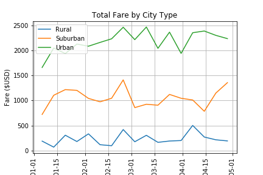

# PyBer_Analysis

### Introduction
The purpose of this report is to create a summary of the key metric of total fares for ride sharing data by city type. The data given was in two different datasets with one containing individual ride information and the other containing driver information. The datasets were combined to observe total fares over time for each of the three city times: Rural, Suburban, and Urban. The attached figure summarizes the findings.

##### Findings
From the findings it can be seen that Urban Cities have the highest total fares over time, ranging approximately from $2000 to $2500 per day. This is followed by Suburban Cities with the second highest total fares over time, typically ranging from $750 to $1500 per day, and Rural Cities with the lowest total fares over time, ranging about $100 to $500 per day. When observing summary statistics, though Urban cities had the highest total fare per day, it also had the largest standard devation or spread. This is the opposite for Rural cities as through they had the lowest total fare per day, the also had a lower spread.

### Challenges / Technical Analysis
Challenges faced during the Analysis was immediately converting data to a usable form. Metrics are not immediately usable and must be calculated from the obtained data of two different datasets. In terms of storage were the datasets kept together, less time would be needed to merge the information together. The key metric of total fare also does not properly capture all aspects of the company's performance. One method that can be used to avoid the work of constant manipulation of the data to help perform the analysis would be to automate the steps. The company should also look into other key performance indicators to fully understand the direction the company is heading in.

### Concluding Remarks
Based on the data from the different city types, what recommendations would you give the CEO for addressing any disparities among the city types? Based on the different city types, the disparities depend primarily on the concentration of people living within each city type. Knowing this, if the company was interested in increasing overall total fares, they would need to market towards Suburban and Rural areas to increase total fares. However more insight is needed. It would be helpful to know if averages fare for individual rides within each city. Urban total fares may be higher, but this may be due to merely higher frequency of usage and not high fares per ride, while Rural individual fares are higher than Urban areas but with a lower frequency of usage. We may also want to look at attributes of individual drivers to see if drivers may be affecting fares and rider usage. In order to find average fare for city type out, we can sort the information by city type. Then divide the total fare per city type by the number of rides. In this way we can understand how the average fare per ride is by city type and use that as insight on how fares work within each city type. For looking at driver attributes, a new dataset would need to be created. It is under the assumption that Ride ID would likely have a data set containing who the rider and driver are. From there it can be determined what the average fare per driver is and by looking into those attributes, the company can more effectively higher drivers with attributes that bring in a higher fare.

